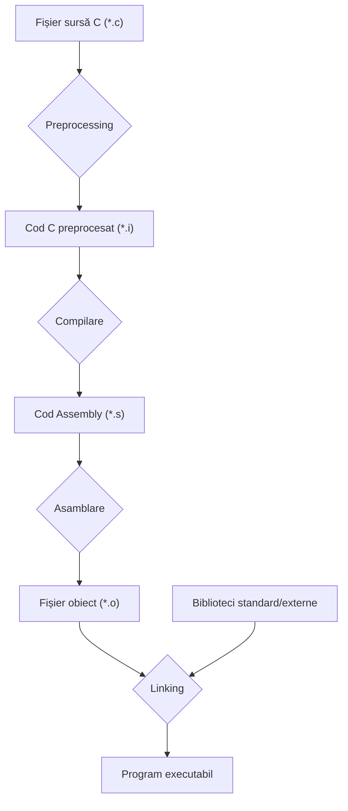

### Introducere în Programare
#### Ce face un computer și cum îi spunem ce să facă

---
layout: cover
color: stone-light
---

## Ce face, de fapt, un computer?

---
layout: top-title
align: c
color: stone-light
---

:: title ::

# Un Computer Face Doar Două Lucruri

:: content ::

<div class="grid grid-cols-2 gap-6 mt-6">
  <div class="neversink-stone-light-scheme bg-[var(--neversink-admon-bg-color)] p-6 rounded-lg border border-[var(--neversink-admon-border-color)]">
    <h3 class="text-lg font-bold text-[var(--neversink-text-color)]">1. Face calcule</h3>
    <div class="text-sm mt-2">

Adunări, comparații, mutări de date. Operații **simple**, dar foarte multe:
miliarde pe secundă.
</div>
  </div>
  <div class="neversink-stone-light-scheme bg-[var(--neversink-admon-bg-color)] p-6 rounded-lg border border-[var(--neversink-admon-border-color)]">
    <h3 class="text-lg font-bold text-[var(--neversink-text-color)]">2. Ține minte rezultatele</h3>
    <div class="text-sm mt-2">

Le stochează în memorie ca să le poată folosi mai târziu. Sute de gigabytes,
accesibile în nanosecunde.
</div>
  </div>
</div>

<br/>

<AdmonitionType type="important" title="Atât.">

Tot ce vedeți pe un ecran — un joc, un browser, o rețea neuronală — este
construit **exclusiv** din aceste două lucruri, repetate de foarte multe ori.

</AdmonitionType>

---
layout: top-title
align: c
color: stone-light
---

:: title ::

# Ce NU Face un Computer

:: content ::

<div class="ns-c-tight text-lg mt-4">

- **Nu știe** nimic. Nu are cunoștințe proprii, nu are intuiție, nu "își dă seama".
- **Nu ghicește** ce ați vrut să spuneți. Execută exact ce i-ați scris.
- **Nu inventează** operații noi. Are un set fix de operații de bază.

</div>

<br/>

<div class="neversink-stone-light-scheme bg-[var(--neversink-admon-bg-color)] p-6 rounded-lg border border-[var(--neversink-admon-border-color)]">
<p class="text-xl text-center">
Un computer este <span class="font-bold text-[var(--neversink-text-color)]">rapid</span> și
<span class="font-bold text-[var(--neversink-text-color)]">ascultător</span> — nu deștept.
</p>
<p class="text-center text-sm mt-2 opacity-80">
Inteligența din program vine de la cel care l-a scris. Adică de la voi.
</p>
</div>

---
layout: cover
color: stone-light
---

## Două feluri de a ști ceva

---
layout: top-title
align: c
color: stone-light
---

:: title ::

# Cunoaștere Declarativă vs Imperativă

:: content ::

Vrem rădăcina pătrată a lui `x`. Există două moduri complet diferite de a
"ști" ce este ea.

<div class="grid grid-cols-2 gap-6 mt-6">
  <div class="neversink-stone-light-scheme bg-[var(--neversink-admon-bg-color)] p-5 rounded-lg border border-[var(--neversink-admon-border-color)]">
    <h3 class="text-lg font-bold text-[var(--neversink-text-color)]">Declarativă — <em>ce</em> este</h3>
    <div class="text-sm mt-3">

> Rădăcina pătrată a lui `x` este acel număr `y ≥ 0` pentru care `y · y = x`.

Este un **enunț de fapt**. Ne spune cum recunoaștem răspunsul corect dacă
cineva ni-l arată.

**Dar nu ne spune cum să-l găsim.**
</div>
  </div>
  <div class="neversink-stone-light-scheme bg-[var(--neversink-admon-bg-color)] p-5 rounded-lg border border-[var(--neversink-admon-border-color)]">
    <h3 class="text-lg font-bold text-[var(--neversink-text-color)]">Imperativă — <em>cum</em> se obține</h3>
    <div class="text-sm mt-3">

> 1. Ghicește o valoare `g`.
> 2. Dacă `g · g` este destul de aproape de `x`, oprește-te.
> 3. Altfel, înlocuiește `g` cu media dintre `g` și `x / g`.
> 4. Repetă de la pasul 2.

Este o **rețetă**. Nu descrie răspunsul — descrie *drumul* către el.
</div>
  </div>
</div>

<br/>

<div class="text-center text-lg">
Un computer poate executa doar cunoaștere <strong>imperativă</strong>.
</div>

---
layout: top-title
align: c
color: stone-light
---

:: title ::

# Rețeta la Lucru

:: content ::

Să urmărim rețeta pentru `x = 25`, pornind de la ghicirea `g = 3`:

<div class="grid grid-cols-2 gap-6 mt-4">
<div>

| pas | `g` | `g · g` |
|---|---|---|
| 0 | 3.0000 | 9.0000 |
| 1 | 5.6667 | 32.1111 |
| 2 | 5.0392 | 25.3934 |
| 3 | 5.0002 | 25.0015 |
| 4 | 5.0000 | 25.0000 |

</div>
<div class="text-sm">

Fiecare pas aplică aceeași regulă simplă: `g = (g + x / g) / 2`.

Nimeni nu "știe" răspunsul la niciun pas. Răspunsul **apare** din repetare.

Exact asta face un computer: pași mărunți, mulți, foarte repede.

</div>
</div>

---
layout: top-title
align: c
color: stone-light
---

:: title ::

# Ce Este un Algoritm

:: content ::

Rețeta de mai devreme are un nume: este un **algoritm**.

<div class="neversink-stone-light-scheme bg-[var(--neversink-admon-bg-color)] p-6 rounded-lg border border-[var(--neversink-admon-border-color)] mt-4">
<p class="text-center text-lg">
Un <strong>algoritm</strong> este o listă <strong>finită</strong> de instrucțiuni
<strong>lipsite de ambiguitate</strong> care, urmate întocmai, rezolvă o problemă
într-un număr finit de pași.
</p>
</div>

<div class="grid grid-cols-3 gap-4 mt-6 text-sm">
  <div class="neversink-stone-light-scheme bg-[var(--neversink-bg-color)] p-4 rounded-lg">
    <h4 class="font-bold text-[var(--neversink-text-color)]">Pași simpli</h4>

Instrucțiuni pe care executantul le poate face fără să gândească.
  </div>
  <div class="neversink-stone-light-scheme bg-[var(--neversink-bg-color)] p-4 rounded-lg">
    <h4 class="font-bold text-[var(--neversink-text-color)]">Control al ordinii</h4>

Când repetăm un pas, când sărim peste el, în funcție de o condiție.
  </div>
  <div class="neversink-stone-light-scheme bg-[var(--neversink-bg-color)] p-4 rounded-lg">
    <h4 class="font-bold text-[var(--neversink-text-color)]">Condiție de oprire</h4>

Un mod de a ști că am terminat. Fără ea, algoritmul rulează la infinit.
  </div>
</div>

<br/>

<AdmonitionType type="tip" title="Programarea, pe scurt">

A programa înseamnă a găsi un algoritm pentru o problemă și a-l scrie într-o
formă pe care mașina o poate executa.

</AdmonitionType>

---
layout: cover
color: stone-light
---

## Mașina care execută rețeta

---
layout: top-title
align: c
color: stone-light
---

:: title ::

# Arhitectura de Bază a unei Mașini

:: content ::

<div class="flex flex-col items-center gap-3 mt-2">

  <div class="w-4/5 text-center py-3 rounded-lg font-mono text-lg neversink-stone-light-scheme bg-[var(--neversink-admon-bg-color)] border border-[var(--neversink-admon-border-color)]">
    MEMORY — datele și programul
  </div>

  <div class="text-2xl leading-none">↕</div>

  <div class="w-4/5 p-3 rounded-lg neversink-stone-light-scheme border border-[var(--neversink-admon-border-color)]">
    <div class="text-xs uppercase tracking-wider opacity-70 mb-2 text-center">CPU</div>
    <div class="grid grid-cols-2 gap-3">
      <div class="text-center py-3 rounded-lg neversink-stone-light-scheme bg-[var(--neversink-admon-bg-color)]">
        <div class="font-mono">CONTROL UNIT</div>
        <div class="text-xs mt-1 opacity-80">program counter — ce instrucțiune urmează</div>
      </div>
      <div class="text-center py-3 rounded-lg neversink-stone-light-scheme bg-[var(--neversink-admon-bg-color)]">
        <div class="font-mono">ARITHMETIC LOGIC UNIT</div>
        <div class="text-xs mt-1 opacity-80">execută operațiile primitive</div>
      </div>
    </div>
  </div>

  <div class="text-2xl leading-none">↕</div>

  <div class="grid grid-cols-2 gap-3 w-3/5">
    <div class="text-center py-2 rounded-lg font-mono neversink-stone-light-scheme bg-[var(--neversink-admon-bg-color)] border border-[var(--neversink-admon-border-color)]">INPUT</div>
    <div class="text-center py-2 rounded-lg font-mono neversink-stone-light-scheme bg-[var(--neversink-admon-bg-color)] border border-[var(--neversink-admon-border-color)]">OUTPUT</div>
  </div>

</div>

---
layout: top-title
align: c
color: stone-light
---

:: title ::

# Cum Rulează, de Fapt, un Program

:: content ::

**Program counter**-ul din control unit ține minte un singur lucru: adresa
instrucțiunii care urmează. Apoi mașina repetă la nesfârșit trei pași:

<div class="grid grid-cols-3 gap-4 mt-6">
  <div class="neversink-stone-light-scheme bg-[var(--neversink-admon-bg-color)] p-4 rounded-lg border border-[var(--neversink-admon-border-color)] text-center">
    <div class="text-2xl">1️⃣</div>
    <h4 class="font-bold text-[var(--neversink-text-color)] mt-1">Fetch</h4>
    <div class="text-sm mt-1">Ia din memory instrucțiunea de la adresa curentă.</div>
  </div>
  <div class="neversink-stone-light-scheme bg-[var(--neversink-admon-bg-color)] p-4 rounded-lg border border-[var(--neversink-admon-border-color)] text-center">
    <div class="text-2xl">2️⃣</div>
    <h4 class="font-bold text-[var(--neversink-text-color)] mt-1">Execute</h4>
    <div class="text-sm mt-1">ALU o execută și scrie rezultatul în memory.</div>
  </div>
  <div class="neversink-stone-light-scheme bg-[var(--neversink-admon-bg-color)] p-4 rounded-lg border border-[var(--neversink-admon-border-color)] text-center">
    <div class="text-2xl">3️⃣</div>
    <h4 class="font-bold text-[var(--neversink-text-color)] mt-1">Advance</h4>
    <div class="text-sm mt-1">Trece la instrucțiunea următoare — sau sare în altă parte.</div>
  </div>
</div>

<br/>

<div class="text-center">
Pasul 3 este cel interesant: dacă mașina poate <strong>sări</strong> în altă parte,
poate repeta și poate alege. De aici vin <code>if</code> și <code>while</code>.
</div>

---
layout: top-title
align: c
color: stone-light
---

:: title ::

# Mașini cu Program Fix vs Mașini Universale

:: content ::

<div class="grid grid-cols-2 gap-6 mt-4">
  <div class="neversink-stone-light-scheme bg-[var(--neversink-admon-bg-color)] p-5 rounded-lg border border-[var(--neversink-admon-border-color)]">
    <h3 class="text-lg font-bold text-[var(--neversink-text-color)]">Program fix</h3>
    <div class="text-sm mt-2">

Un calculator de buzunar știe să adune și să înmulțească — și **atât**, pentru
totdeauna. Algoritmul este construit în hardware.

Ca să facă altceva, trebuie construită altă mașină.
</div>
  </div>
  <div class="neversink-stone-light-scheme bg-[var(--neversink-admon-bg-color)] p-5 rounded-lg border border-[var(--neversink-admon-border-color)]">
    <h3 class="text-lg font-bold text-[var(--neversink-text-color)]">Program stocat</h3>
    <div class="text-sm mt-2">

Într-un computer, **programul stă în memory, la fel ca datele**. Mașina îl
citește de acolo, instrucțiune cu instrucțiune.

Ca să facă altceva, îi dăm alt program.
</div>
  </div>
</div>

<br/>

<AdmonitionType type="note" title="De ce contează">

Această idee — programul ca dată în memorie — este motivul pentru care
*aceeași* mașină rulează și un editor de text, și un joc. Și motivul pentru
care meseria de programator există.

</AdmonitionType>

---
layout: cover
color: stone-light
---

## Cum vorbim cu mașina

---
layout: top-title
align: c
color: stone-light
---

:: title ::

# Terminalul, GUI și TUI

:: content ::

<div class="grid grid-cols-3 gap-4 mt-2 text-sm">
  <div class="neversink-stone-light-scheme bg-[var(--neversink-bg-color)] p-4 rounded-lg">
    <h4 class="font-bold text-[var(--neversink-text-color)]">GUI</h4>
    <div class="text-xs opacity-70 mb-2">Graphical User Interface</div>

Ferestre, butoane, mouse. Ușor de învățat, dar puteți face doar ce a prevăzut
cineva ca buton.
  </div>
  <div class="neversink-stone-light-scheme bg-[var(--neversink-bg-color)] p-4 rounded-lg">
    <h4 class="font-bold text-[var(--neversink-text-color)]">TUI</h4>
    <div class="text-xs opacity-70 mb-2">Text User Interface</div>

Interfață desenată din text, cu meniuri și taste. Rulează în terminal.
  </div>
  <div class="neversink-stone-light-scheme bg-[var(--neversink-bg-color)] p-4 rounded-lg">
    <h4 class="font-bold text-[var(--neversink-text-color)]">CLI</h4>
    <div class="text-xs opacity-70 mb-2">Command Line Interface</div>

Scrieți o comandă, primiți un răspuns. Aici vom compila și rula programele
noastre.
  </div>
</div>

<br/>

**Terminalul** este fereastra în care se întâmplă asta. Câteva comenzi de
supraviețuire:

```bash
ls                      # ce fișiere sunt aici
cd nume-director        # intră în director
cd ..                   # urcă un nivel
pwd                     # unde mă aflu
gcc hello.c -o hello    # compilează
./hello                 # rulează
```

---
layout: cover
color: stone-light
---

## Limbaje de programare

---
layout: top-title
align: c
color: stone-light
---

:: title ::

# Un Limbaj de Programare Are Trei Straturi

:: content ::

<div class="ns-c-tight mt-4">

- **Primitivele** — cuvintele. Cele mai simple lucruri pe care limbajul le știe
  face: un număr, o adunare, o comparație.

- **Sintaxa** — ce înșiruiri de cuvinte sunt *corecte gramatical*.
  `printf("Salut");` este o propoziție validă; `printf "Salut"` nu este.

- **Semantica** — ce **înseamnă** o propoziție corectă gramatical.
  Aici apare partea neplăcută: o propoziție poate fi perfect corectă și
  totuși să însemne altceva decât ați vrut.

</div>

<br/>

<div class="neversink-stone-light-scheme bg-[var(--neversink-admon-bg-color)] p-5 rounded-lg border border-[var(--neversink-admon-border-color)]">
<p class="text-center">
În română, „Mâine am mâncat mere" este corect gramatical și totuși fără sens.<br/>
Un computer nu observă asta. Execută propoziția.
</p>
</div>

---
layout: top-title
align: c
color: stone-light
---

:: title ::

# Din Ce Este Făcut un Program

:: content ::

Codul sursă este text. Compilatorul îl taie mai întâi în **tokens** — cele mai
mici bucăți cu înțeles de sine stătător:

```c
int suma = a + 10;
```

<div class="grid grid-cols-7 gap-2 mt-4 text-center text-sm font-mono">
  <div class="p-2 rounded neversink-stone-light-scheme bg-[var(--neversink-admon-bg-color)]">int</div>
  <div class="p-2 rounded neversink-stone-light-scheme bg-[var(--neversink-admon-bg-color)]">suma</div>
  <div class="p-2 rounded neversink-stone-light-scheme bg-[var(--neversink-admon-bg-color)]">=</div>
  <div class="p-2 rounded neversink-stone-light-scheme bg-[var(--neversink-admon-bg-color)]">a</div>
  <div class="p-2 rounded neversink-stone-light-scheme bg-[var(--neversink-admon-bg-color)]">+</div>
  <div class="p-2 rounded neversink-stone-light-scheme bg-[var(--neversink-admon-bg-color)]">10</div>
  <div class="p-2 rounded neversink-stone-light-scheme bg-[var(--neversink-admon-bg-color)]">;</div>
</div>

<div class="grid grid-cols-7 gap-2 mt-1 text-center text-xs opacity-70">
  <div>keyword</div>
  <div>identifier</div>
  <div>operator</div>
  <div>identifier</div>
  <div>operator</div>
  <div>literal</div>
  <div>separator</div>
</div>

<br/>

Tokens formează **instrucțiuni** (statements), terminate în C cu `;`.
Instrucțiunile formează **funcții**. Funcțiile formează **programul**.

---
layout: top-title
align: c
color: stone-light
---

:: title ::

# Tipuri de Limbaje

:: content ::

<div class="grid grid-cols-2 gap-6 mt-2 text-sm">
  <div class="neversink-stone-light-scheme bg-[var(--neversink-admon-bg-color)] p-5 rounded-lg border border-[var(--neversink-admon-border-color)]">
    <h3 class="text-base font-bold text-[var(--neversink-text-color)]">Low-level vs high-level</h3>

**Low-level**: lucrați direct cu instrucțiunile mașinii și cu memoria
(assembly). Puternic, dar fiecare detaliu cade în sarcina voastră.

**High-level**: lucrați cu noțiuni abstracte, iar detaliile mașinii sunt
ascunse (Python, Java).

C stă **între** ele — de asta îl învățăm.
  </div>
  <div class="neversink-stone-light-scheme bg-[var(--neversink-admon-bg-color)] p-5 rounded-lg border border-[var(--neversink-admon-border-color)]">
    <h3 class="text-base font-bold text-[var(--neversink-text-color)]">Compilate vs interpretate</h3>

**Compilate**: un program traduce tot codul în cod mașină **înainte** de
rulare. Rezultă un executabil rapid (C, C++, Rust).

**Interpretate**: un alt program citește codul și îl execută **în timp ce**
rulează (Python, JavaScript). Mai flexibil, mai lent.
  </div>
</div>

<br/>

<div class="text-center text-sm opacity-80">
Mai există și clasificarea după scop: limbaje <strong>generale</strong> (C, Java)
vs limbaje <strong>specializate</strong> pe un domeniu (SQL pentru baze de date,
HTML pentru pagini web).
</div>

---
layout: top-title
align: c
color: stone-light
---

:: title ::

# De Ce C și de Unde Vine

:: content ::

<div class="grid grid-cols-2 gap-6">
<div class="text-sm">

### Scurt istoric

- **1972** — Dennis Ritchie creează C la Bell Labs, ca să poată rescrie
  sistemul de operare **UNIX** într-un limbaj care nu e assembly.
- **1978** — apare *The C Programming Language* (Kernighan & Ritchie), cartea
  care a definit limbajul pentru o generație.
- **1989** — standardizare ANSI: **C89**. Urmează **C99**, **C11**, **C17**,
  **C23**.

Peste 50 de ani și limbajul este încă în primele locuri ca utilizare.

</div>
<div class="text-sm">

### De ce îl învățăm

- **Fundație** — sintaxa lui se regăsește în C++, Java, C#, JavaScript, Go.
  Îl învățați o dată, recunoașteți jumătate din limbajele moderne.
- **Transparență** — C nu ascunde memoria. Veți vedea *cum* funcționează un
  program, nu doar *că* funcționează.
- **Relevanță** — kernelul Linux, bazele de date, driverele și microcon-
  trollerele sunt scrise în C.

</div>
</div>

<br/>

<AdmonitionType type="warning" title="Prețul transparenței">

C vă lasă să faceți greșeli pe care alte limbaje le-ar opri. De asta este un
limbaj excelent de **învățat**: greșelile devin vizibile și inteligibile.

</AdmonitionType>

---
layout: cover
color: stone-light
---

## De la text la program care rulează

---
layout: top-title
align: c
color: stone-light
---

:: title ::

# Ce Face un Compiler

:: content ::

Procesorul nu înțelege litere. Înțelege numere — cod mașină. **Compilatorul**
este programul care traduce textul vostru în acele numere.

<div class="neversink-stone-light-scheme bg-[var(--neversink-admon-bg-color)] p-5 rounded-lg border border-[var(--neversink-admon-border-color)] mt-6 text-center">
<p class="font-mono text-lg">
<span class="text-red-500">hello.c</span>
<span class="mx-3">➡️</span> compiler (gcc)
<span class="mx-3">➡️</span> <span class="text-green-600">hello</span>
</p>
<p class="text-sm mt-2 opacity-80">text scris de om &nbsp;&nbsp;→&nbsp;&nbsp; cod mașină executabil</p>
</div>

<br/>

<div class="ns-c-tight text-sm">

- Traducerea se face **o singură dată**, înainte de rulare.
- Executabilul rezultat nu mai are nevoie de compilator ca să ruleze.
- Dacă modificați codul sursă, trebuie să **recompilați** — altfel rulați
  în continuare versiunea veche.

</div>

---
layout: center
---



---
layout: top-title
align: c
color: stone-light
---

:: title ::

# Cele Patru Etape

:: content ::

<div class="ns-c-tight text-sm mt-2">

- **Preprocessing** — se rezolvă liniile care încep cu `#`. `#include <stdio.h>`
  este înlocuit cu conținutul acelui fișier. Rezultatul este tot cod C, doar
  mai lung.

- **Compilare** — codul C este tradus în assembly, limbajul mașinii scris în
  cuvinte. Aici sunt raportate erorile de sintaxă.

- **Asamblare** — assembly devine cod mașină binar: un **fișier obiect**.
  Este cod real, dar incomplet: nu știe încă unde se află `printf`.

- **Linking** — fișierele obiect se leagă între ele și de bibliotecile
  standard. Acum `printf` are o adresă. Rezultă **executabilul**.

</div>

<br/>

<AdmonitionType type="tip" title="De ce contează distincția">

O eroare la compilare arată o linie din codul vostru. O eroare la linking sună
altfel — `undefined reference to 'sqrt'` — și înseamnă de obicei că lipsește o
bibliotecă, nu că ați greșit sintaxa.

</AdmonitionType>

---
layout: top-title
align: c
color: stone-light
---

:: title ::

# Patru Feluri de a Greși

:: content ::

<div class="ns-c-tight text-sm mt-2">

- **Erori de sintaxă** — programul nu este corect gramatical. Ați uitat un `;`
  sau o acoladă. Compilatorul refuză să traducă și vă arată linia. **Cele mai
  ușoare.**

- **Erori de semantică statică** — este corect gramatical, dar fără sens ca
  tipuri: adunați un text cu un număr. Compilatorul le prinde tot înainte de
  rulare, dar mesajele sunt mai criptice.

- **Erori la rulare (runtime)** — programul compilează, pornește și apoi
  crapă: împărțire la zero, `segmentation fault`.

- **Rezultat greșit** — programul compilează, rulează, se termină frumos și
  afișează un număr **greșit**. Nimeni nu vă anunță. **Cele mai periculoase.**

</div>

<br/>

```c
int main(void) {
    printf("Salut\n")     // ← lipsește ';' — eroare de sintaxă
    return 0;
}
```

---
layout: top-title
align: c
color: stone-light
---

:: title ::

# Primitivele Limbajului C

:: content ::

Orice program, oricât de complex, este construit din câteva cărămizi de bază:

<div class="grid grid-cols-3 gap-4 mt-4 text-sm">
  <div class="neversink-stone-light-scheme bg-[var(--neversink-bg-color)] p-4 rounded-lg">
    <h4 class="font-bold text-[var(--neversink-text-color)]">Tipuri de date</h4>

`int` — numere întregi<br/>
`char` — un caracter<br/>
`float`, `double` — numere reale
  </div>
  <div class="neversink-stone-light-scheme bg-[var(--neversink-bg-color)] p-4 rounded-lg">
    <h4 class="font-bold text-[var(--neversink-text-color)]">Operatori</h4>

`+` `-` `*` `/` `%` — aritmetici<br/>
`<` `>` `==` `!=` — comparații<br/>
`=` — atribuire
  </div>
  <div class="neversink-stone-light-scheme bg-[var(--neversink-bg-color)] p-4 rounded-lg">
    <h4 class="font-bold text-[var(--neversink-text-color)]">Literali</h4>

`42` — un întreg<br/>
`'A'` — un caracter<br/>
`3.14` — un număr real
  </div>
</div>

<br/>

<div class="text-center">
Din aceste primitive plus <strong>control al ordinii</strong> (<code>if</code>,
<code>while</code>) se poate scrie <strong>orice</strong> algoritm.
<br/>
<span class="text-sm opacity-80">Restul semestrului este despre cum le combinăm bine.</span>
</div>

---
layout: cover
color: stone-light
---

## Primul program

---
layout: top-title
align: c
color: stone-light
---

:: title ::

# Hello, World!

:: content ::

Apăsați **Run** — codul se compilează și rulează chiar aici, în slide.

```c {monaco-run}
#include <stdio.h>

int main(void) {
    printf("Salut, lume!\n");
    return 0;
}
```

<div class="text-sm mt-4 opacity-80 text-center">
Încercați să modificați textul dintre ghilimele și să rulați din nou.
</div>

---
layout: top-title
align: c
color: stone-light
---

:: title ::

# Ce Înseamnă Fiecare Linie

:: content ::

<div class="flex items-center gap-6">

<div class="ns-c-tight text-sm flex-1">

- **`#include <stdio.h>`** — cerem preprocesorului să aducă aici biblioteca
  standard de input/output. Fără ea, `printf` nu ar exista.

- **`int main(void)`** — funcția principală. **Execuția oricărui program C
  începe de aici.** `void` înseamnă că nu primește argumente.

- **`{ }`** — acoladele delimitează corpul funcției: unde începe și unde se
  termină.

- **`printf("Salut, lume!\n");`** — afișează textul. `\n` înseamnă „treci pe
  linie nouă". `;` marchează sfârșitul instrucțiunii — este **obligatoriu**.

- **`return 0;`** — anunță sistemul de operare că programul s-a terminat cu
  succes. Prin convenție, `0` înseamnă „totul a fost bine".

</div>

<div class="flex-1">

```c{*|1|3|4|5|3-6}
#include <stdio.h>

int main(void) {
    printf("Salut, lume!\n");
    return 0;
}
```

</div>
</div>

---
layout: top-title
align: c
color: stone-light
---

:: title ::

# Compilare și Rulare în Terminal

:: content ::

Salvați codul într-un fișier `hello.c`, apoi:

```bash
gcc hello.c -o hello
```

<div class="ns-c-tight text-sm">

- `gcc` — compilatorul
- `hello.c` — fișierul sursă, ce ați scris voi
- `-o hello` — numele executabilului care va rezulta

</div>

Dacă nu apare niciun mesaj, compilarea a reușit. Acum rulați programul:

```bash
./hello
```

```text
Salut, lume!
```

<AdmonitionType type="note" title="`./` nu este decorativ">

Îi spune shell-ului să caute programul **în directorul curent**, nu printre
comenzile sistemului.

</AdmonitionType>

---
layout: top-title
align: c
color: stone-light
---

:: title ::

# Algoritmul de la Început, în C

:: content ::

Rețeta pentru rădăcina pătrată, scrisă ca program. Nu trebuie să înțelegeți
încă fiecare linie — priviți doar **forma**: repetare, condiție, oprire.

```c {monaco-run}
#include <stdio.h>

int main(void) {
    double x = 25.0;
    double g = 3.0;         // ghicirea inițială

    while (g * g - x > 0.0001 || x - g * g > 0.0001) {
        g = (g + x / g) / 2;   // pasul din rețetă
        printf("g = %.4f\n", g);
    }

    printf("Radacina lui %.1f este %.4f\n", x, g);
    return 0;
}
```

---
layout: top-title
align: c
color: stone-light
---

:: title ::

# De Reținut

:: content ::

<div class="ns-c-tight text-lg mt-4">

- Un computer **calculează** și **ține minte** — nimic altceva. Nu știe, nu
  ghicește.
- Cunoașterea **declarativă** spune *ce*; cea **imperativă** spune *cum*. Doar
  a doua se poate executa.
- Un **algoritm** este o rețetă finită, neambiguă, cu o condiție de oprire.
- Programul stă în **memory**, ca datele — de asta aceeași mașină poate face
  orice.
- Un limbaj are **primitive**, **sintaxă** și **semantică**. Compilatorul
  verifică primele două; de a treia răspundeți voi.
- **Compilatorul** traduce `.c` → executabil, în patru etape: preprocessing,
  compilare, asamblare, linking.

</div>

---
layout: top-title
align: c
color: stone-light
---

:: title ::

# Sarcini de Laborator

:: content ::

<AdmonitionType type="tip" title="1. Salut personalizat">

Scrieți un program care afișează pe trei rânduri: numele vostru, grupa și
anul de studiu. Compilați-l din terminal și rulați-l.

</AdmonitionType>

<AdmonitionType type="important" title="2. Provocați compilatorul">

Porniți de la programul funcțional și stricați-l, pe rând, în trei feluri:
ștergeți un `;`, ștergeți o acoladă, scrieți `printff` în loc de `printf`.

Notați de fiecare dată **mesajul exact** al compilatorului. La ce linie arată?
Care dintre cele trei erori este semnalată de linker, nu de compilator?

</AdmonitionType>

<AdmonitionType type="note" title="3. Un algoritm din viața reală">

Scrieți în cuvinte, pe pași, algoritmul după care căutați un cuvânt într-un
dicționar tipărit. Care este condiția de oprire?

</AdmonitionType>

---
layout: top-title
color: stone-light
align: c
---

:: title ::

# Mai departe

:: content ::

<div class="mt-12">

<DeckNav />

</div>
